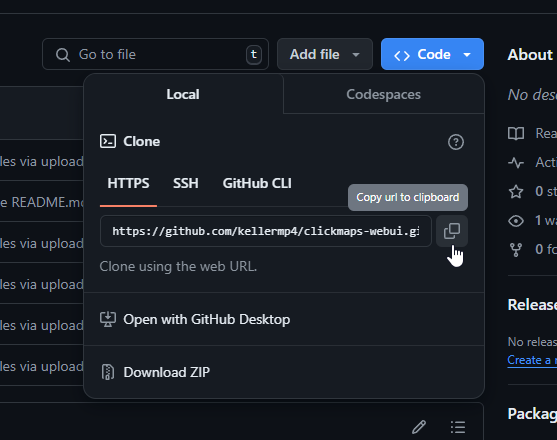

# Welcome!
Clickmaps webui is a way to let people access your computer remotely.
# Requirements
[Git for Windows](https://git-scm.com/) and [Python 3.9](https://www.python.org/downloads/release/python-3911/) is required for this project.
# Installation
Once you have Git and Python installed, click on `Code` and then copy the link.
